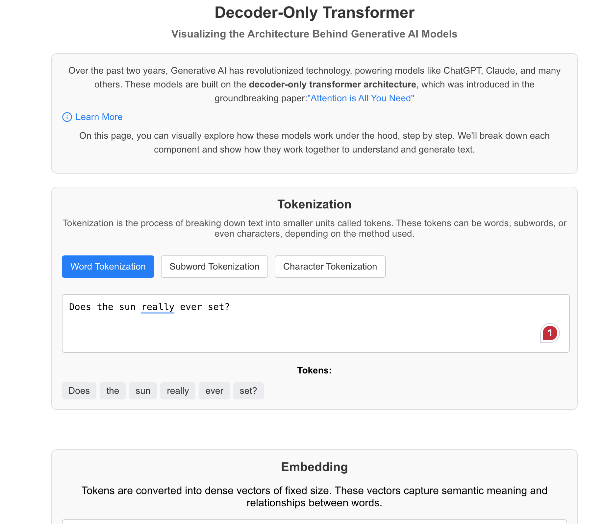

# Decoder-Only Transformer Visualization

 <!-- Add a screenshot if available -->

An interactive learning page to visualize the architecture of **decoder-only transformers**, the backbone of modern Generative AI models like ChatGPT and Claude. This project breaks down the key components of the transformer architecture, including tokenization, embedding, positional encoding, multi-head attention, and output generation.

👉 [Live Demo](https://github.com/Saiprapul/transformer-viz) <!-- Add your GitHub Pages link here -->

---

## Features

- **Tokenization**: Visualize how input text is broken down into tokens using different tokenization methods (word, subword, character).
- **Embedding**: Understand how tokens are converted into dense vectors.
- **Positional Encoding**: See how positional information is added to embeddings.
- **Multi-Head Attention**: Explore how attention mechanisms work in transformers.
- **Output Generation**: Watch how the model generates output step by step.
- **Interactive Learning**: Toggle between different tokenization methods and see how they affect the input text.

---

## Technologies Used

- **React**: Frontend framework for building the interactive UI.
- **TypeScript**: For type-safe and scalable code.
- **Lucide Icons**: For clean and modern icons.
- **GitHub Pages**: For hosting the live demo.

---

## Getting Started

### Prerequisites

- Node.js (v16 or higher)
- npm (v7 or higher)

### Installation

1. Clone the repository:

   ```bash
   git clone https://github.com/Saiprapul/transformer-viz